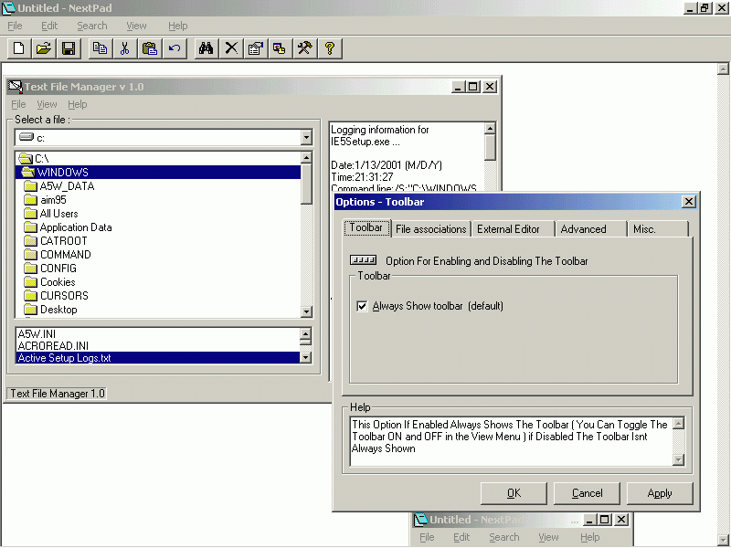



## NextPad    \(Update\)

### Description

Hello And Welcome Too NextPad,, Thanks For Downloading the Source Its Probably Not too great But hey !!

Any way It has .

----

* Word wrap ,

* Clipboard Options ,

* Can Launch Another Editor If The File That Is Being attempted too be opened is too large ,

* has an Options dialog

* can Be Used on the command Line and ,

* can Be the Default text Viewer for (*.TXT) Files......

* Set Font

* AWESOME Text File Manager ( Text Files Can Be viewed On the FLY !!! , No need too use a commondialog )

* Find Dialog

* AUTHENTIC windows core component Properties dialog , Strait From the windows API !!!!

* Launch New instance , Through A menu or dialog

* Has a Toolbar

* Has A Clipboard Viewer , Editor

* Full screen Mode

* Recent File Menu

* Undo Option Added

* Option Too Alter NextPad's Thread Process Priority

* Option For NextPad Not Too ask Too Launch External Editor , Just Launch it.

----

THIS PROGRAM CRUSHES NOTEPAD IN ITS OPTIONS AND ABILITIES !!!!!

If you like it Vote for me Otherwise You dont have too .

Thanks;

Developer : Jason - simeone

age : 15

Hobbys : VB 5

Code Was Revised , Restructured ...............
 
### More Info
 
Nothing what so ever ,But you should not set the Thread's Default Process Priority Level in nextPad if you are running Windows 2000 OR NT

             |
---                |---
**Submitted On**   |2001-01-29 20:05:42
**By**             |[Jason](https://github.com/Planet-Source-Code/PSCIndex/blob/master/ByAuthor/jason.md)
**Level**          |Beginner
**User Rating**    |3.8 (19 globes from 5 users)
**Compatibility**  |VB 5\.0, VB 6\.0
**Category**       |[Miscellaneous](https://github.com/Planet-Source-Code/PSCIndex/blob/master/ByCategory/miscellaneous__1-1.md)
**World**          |[Visual Basic](https://github.com/Planet-Source-Code/PSCIndex/blob/master/ByWorld/visual-basic.md)
**Archive File**   |[CODE\_UPLOAD143121302001\.zip](https://github.com/Planet-Source-Code/jason-nextpad-update__1-14825/archive/master.zip)

